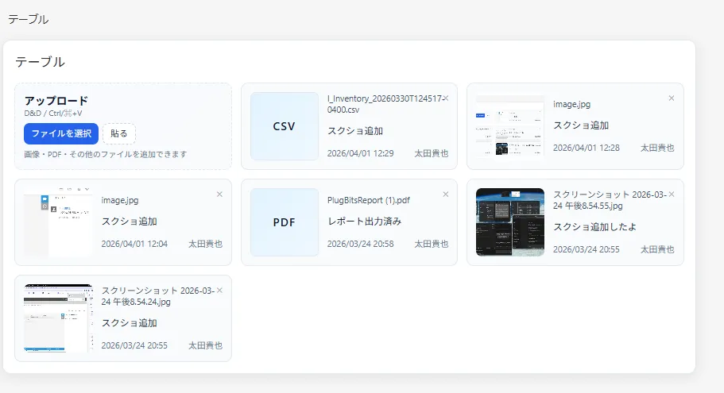
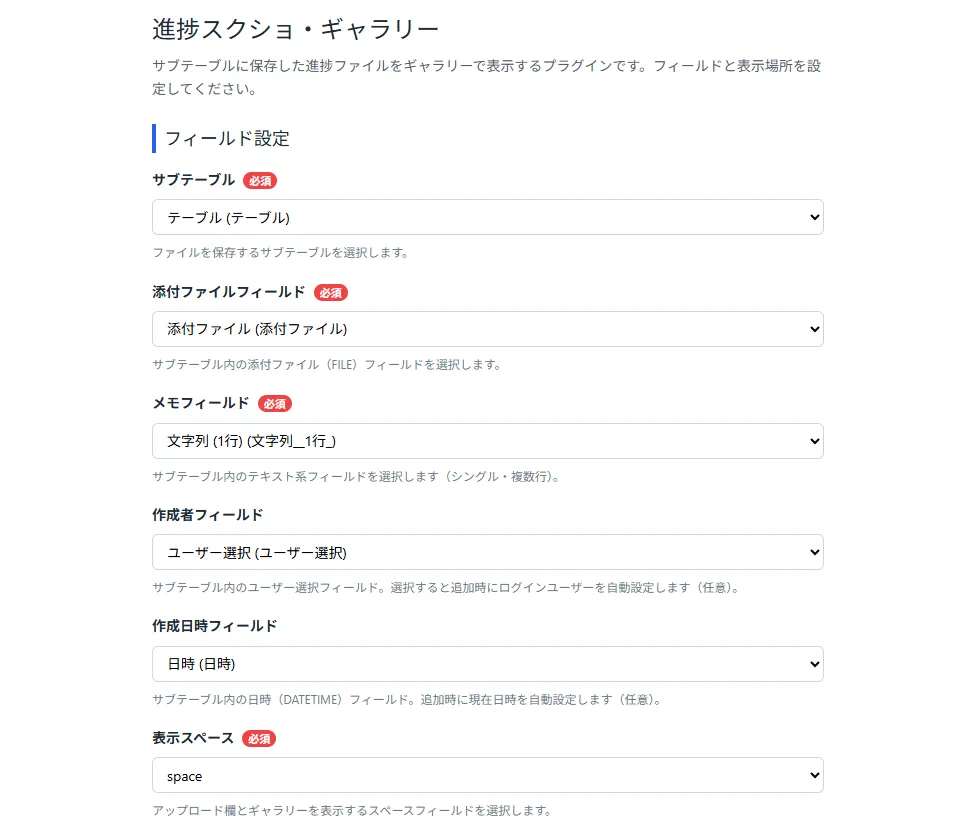
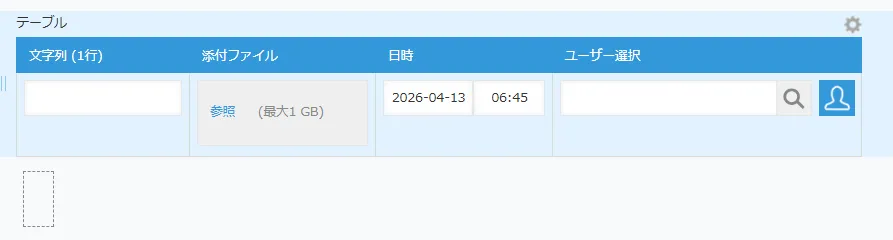
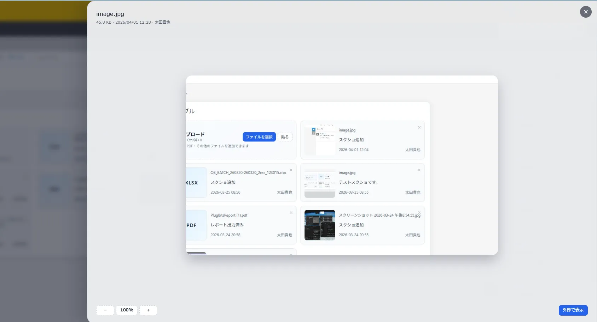

# サブテーブルギャラリー化プラグイン マニュアル

## できること

kintone のレコード詳細画面に、写真・PDF などのファイルをドロップするだけでギャラリー表示に変換するプラグインです。

- ドラッグ＆ドロップ・ファイル選択・コピー貼り付けで投稿
- 画像・PDF をその場でプレビュー
- メモのインライン編集
- 投稿者・投稿日時の自動記録
- グリッド／横スクロール切替

---

## 事前準備（アプリ側）

プラグインを使う前に、kintone アプリに以下のフィールドを追加してください。

| 種類 | 必須 | 用途 |
|---|---|---|
| サブテーブル | ✓ | 投稿データの保存先 |
| 添付ファイルフィールド（テーブル内） | ✓ | ファイル本体 |
| 文字列フィールド（テーブル内） | ✓ | メモ欄 |
| スペースフィールド | ✓ | ギャラリーの表示場所 |
| ユーザー選択フィールド（テーブル内） | − | 投稿者の自動記録 |
| 日時フィールド（テーブル内） | − | 投稿日時の自動記録 |

---

## 初期設定

1. kintone アプリ設定 → **プラグイン** を開く
2. ダウンロードした ZIP ファイルをアップロードして追加
3. プラグイン一覧から本プラグインの設定画面を開く
4. 各フィールドを選択して **保存** → アプリを更新

### 設定項目

| 項目 | 説明 |
|---|---|
| サブテーブル | 保存先のサブテーブルを選択 |
| 添付ファイルフィールド | ファイルを格納するフィールド |
| メモフィールド | コメントを格納するフィールド |
| 作成者フィールド | 任意。投稿者を自動記録 |
| 作成日時フィールド | 任意。投稿日時を自動記録 |
| 表示スペース | ギャラリーを表示するスペースフィールド |
| 表示レイアウト | グリッド or 横スクロール |
| 画像圧縮 | 有効にすると JPEG 変換して保存 |

---

## 使い方

レコードの詳細画面を開くと、設定したスペースにアップロード欄とギャラリーが表示されます。

### ファイルを追加する

| 方法 | 対応ファイル |
|---|---|
| ファイルを選択 | 画像・PDF・その他すべて |
| ドラッグ＆ドロップ | 画像・PDF・その他すべて |
| コピー＆貼り付け | **画像のみ** |

追加後はレコードが自動保存され、ギャラリーに即反映されます。

### メモを編集する

メモ部分をクリックするとその場で編集できます。`Enter` または欄外クリックで保存、`Esc` でキャンセル。

### ファイルを開く

サムネイルをクリックするとプレビューが開きます。画像は拡大・縮小が可能。PDF はそのまま閲覧できます。

---

## よくある質問

**投稿したのに表示されない**
プラグイン設定のフィールド指定が正しいか、アプリを更新済みか、表示スペースがフォーム上にあるかを確認してください。

**貼り付けができない**
画像のコピーであることを確認してください。PDF・テキストの貼り付けには対応していません。

**投稿者・日時が自動入力されない**
プラグイン設定で対象フィールドを設定してください。

---

## 注意事項

- このプラグインは裏側でサブテーブルを使って保存しています。詳細画面では標準のサブテーブル表示を隠し、ギャラリーに置き換えています。
- 画像圧縮を有効にすると、保存時に JPEG 変換されます。画質を厳密に維持したい場合は圧縮をオフにしてください。
- モバイル端末には対応していません（PC 専用）。
