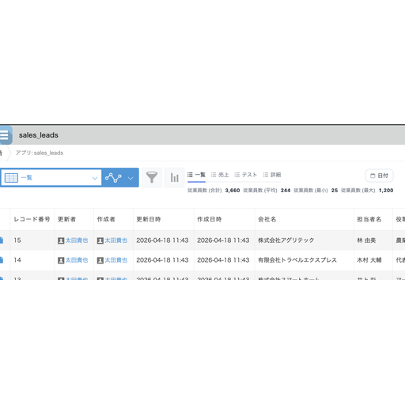
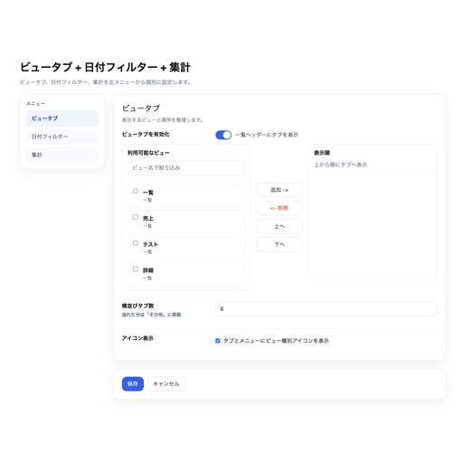
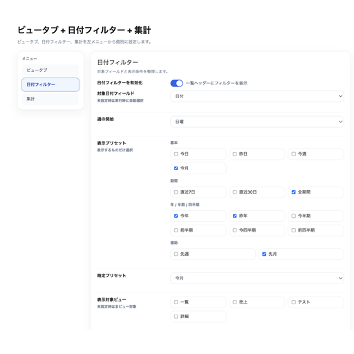
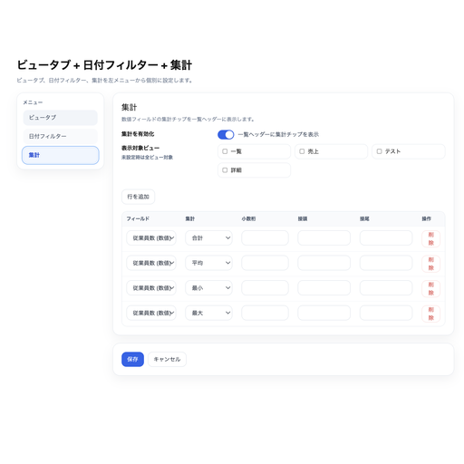
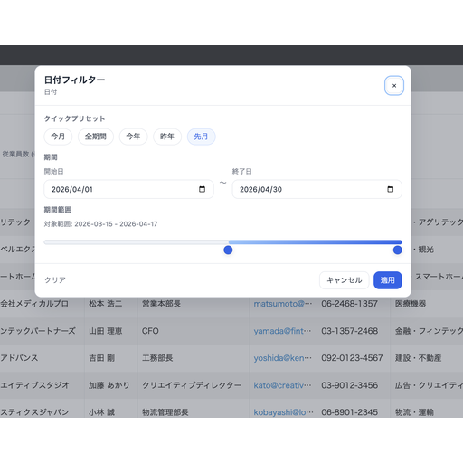

## できること

kintone の一覧画面に **ビュータブ・日付フィルター・集計** の 3 つの機能をまとめて追加するプラグインです。よく使うビューへの切替、期間でのワンクリック絞り込み、件数や金額の確認を一覧上部に集約します。

- 一覧上部にビュー切替タブを表示（順序・横並び数・アイコン表示を制御）
- 日付・日時フィールドを期間プリセット（今週・今月・四半期・半期・年など）で絞り込み
- 数値・計算フィールドの合計／平均／最小／最大／件数を一覧上部に表示
- ビューごとに日付フィルターと集計の表示対象を制御
- 接頭文字・接尾文字・小数桁を自由に設定

---

## 事前準備（アプリ側）

プラグインを使う前に、kintone アプリに以下を用意してください。基本的には既存のフィールドをそのまま使えます。

| 種類 | 必須 | 用途 |
|---|---|---|
| 一覧（ビュー） | ✓ | タブで切替する対象 |
| 日付 / 日時フィールド | − | 日付フィルターを使う場合 |
| 数値 / 計算フィールド | − | 集計を使う場合 |

> 日付フィルター・集計は使わない場合はオフにできます。ビュータブだけの利用も可能です。

---

## 初期設定

1. kintone アプリ設定 → **プラグイン** を開く
2. ダウンロードした ZIP ファイルをアップロードして追加
3. プラグイン一覧から **PlugBits ListKit** の設定画面を開く
4. 左メニューから「ビュータブ」「日付フィルター」「集計」を切り替えながら設定 → **保存** → アプリを更新

設定画面は左サイドメニューで 3 つのセクションに分かれています。それぞれ独立したトグルで有効／無効を切り替えられます。

### ビュータブ設定

| 項目 | 説明 |
|---|---|
| ビュータブを有効化 | オンで一覧上部にタブを表示 |
| 利用可能なビュー | タブに出せるビューの一覧 |
| 表示順 | 実際に表示するビュー（上から順に左→右に並ぶ） |
| 追加 / 削除 | 表示対象に出し入れ |
| 上へ / 下へ | タブの順番を変更 |
| 横並びタブ数 | 直接表示するタブ数。超えた分は **その他** に集約 |
| アイコン表示 | ビュー種別アイコン（一覧／カレンダー等）の表示切替 |

### 日付フィルター設定

| 項目 | 説明 |
|---|---|
| 日付フィルターを有効化 | オンで一覧上部に日付ボタンを表示 |
| 対象日付フィールド | 絞り込みに使う日付 / 日時フィールド |
| 週の開始 | 「今週／先週」の基準（日曜 or 月曜） |
| 表示プリセット | 利用者に表示する期間ボタンを選択 |
| 既定プリセット | 初期表示で適用する期間 |
| 表示対象ビュー | 日付フィルターを表示するビュー（未選択なら全ビュー） |

### 集計設定

| 項目 | 説明 |
|---|---|
| 集計を有効化 | オンで一覧上部に集計を表示 |
| 表示対象ビュー | 集計を表示するビュー（未選択なら全ビュー） |
| 行を追加 | 集計ルールを追加（複数可） |

各集計行で設定する内容:

| 項目 | 説明 |
|---|---|
| フィールド | 数値フィールドまたは計算フィールド |
| 集計 | 合計 / 平均 / 最小 / 最大 / 件数 |
| 小数桁 | 小数点以下の表示桁数 |
| 接頭 | 数字の前に付ける文字（例：`¥`、`$`） |
| 接尾 | 数字の後に付ける文字（例：`円`、`件`） |

---

## 使い方

設定後、対象アプリの一覧画面を開くと、上部にタブ・日付フィルター・集計が表示されます。

### ビューを切り替える

タブをクリックするとビューが切り替わります。横並びタブ数を超えた分は **その他** メニューから選択できます。

### 期間で絞り込む

1. **日付** ボタンをクリック
2. 期間プリセットを選ぶか、開始日と終了日を直接入力
3. **適用** で絞り込み実行
4. 条件を外すときは **クリア**

絞り込みは kintone 標準のフィルターと連動するため、URL の共有やブックマークでも条件が維持されます。

### 集計を確認する

集計は一覧上部に常時表示され、現在のビューと絞り込み条件に応じて自動で再計算されます。日付フィルターで期間を変えると、その期間に該当するレコードだけが集計されます。

---

## よくある質問

**日付フィルターが表示されない**
プラグイン設定で日付フィルターが有効になっているか、対象ビューに含まれているか、日付または日時フィールドが設定されているかを確認してください。

**集計が表示されない**
集計が有効になっているか、集計ルールが 1 件以上あるか、数値または計算フィールドを選んでいるかを確認してください。

**タブが多すぎて見切れる**
横並びタブ数を超えた分は **その他** に入ります。設定画面で表示順や横並びタブ数を調整してください。

**設定を変えたのに反映されない**
保存後にアプリを更新（右上の **アプリを更新**）してください。kintone のプラグイン設定は、アプリ更新後に有効になります。

**動作が重い**
集計対象のビューを減らす、集計行を減らす、または不要な機能をオフにしてください。

---

## 注意事項

- PC 版の一覧画面専用です。モバイル版には対応していません。
- 日付フィルターには日付または日時フィールドが必要です。
- 集計には数値または計算フィールドが必要です。
- レコード件数や集計対象が多い場合、表示に時間がかかることがあります。
- 設定変更後は必ずアプリを更新してください。
